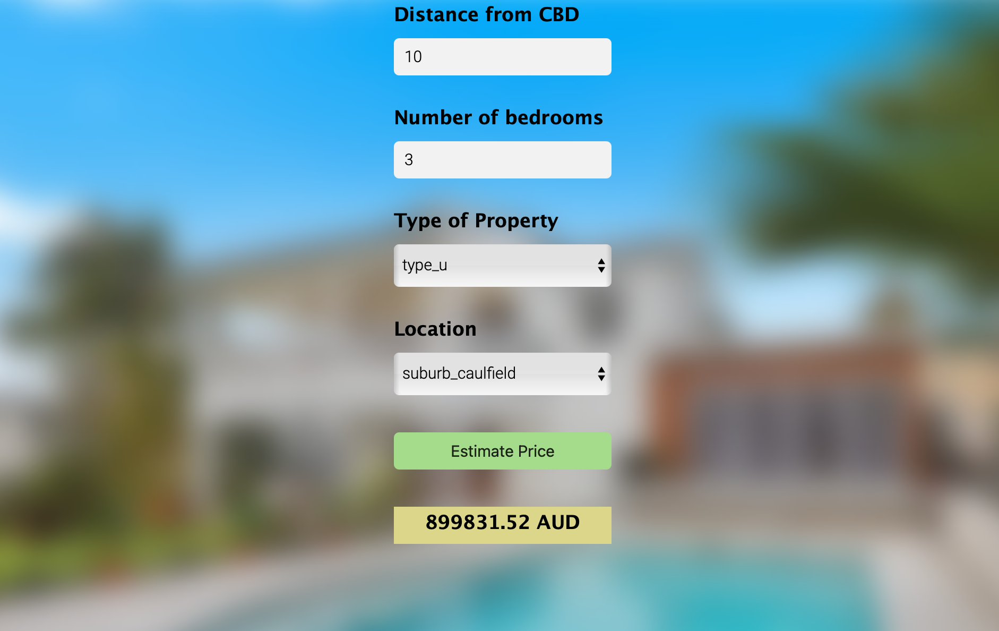

# Melbourne-House-Price-Prediction

This project is a simple Machine learning application created using Flask, which can predict the price of a property in and around Melbourne. 
The data can be found at https://www.kaggle.com/anthonypino/melbourne-housing-market 

